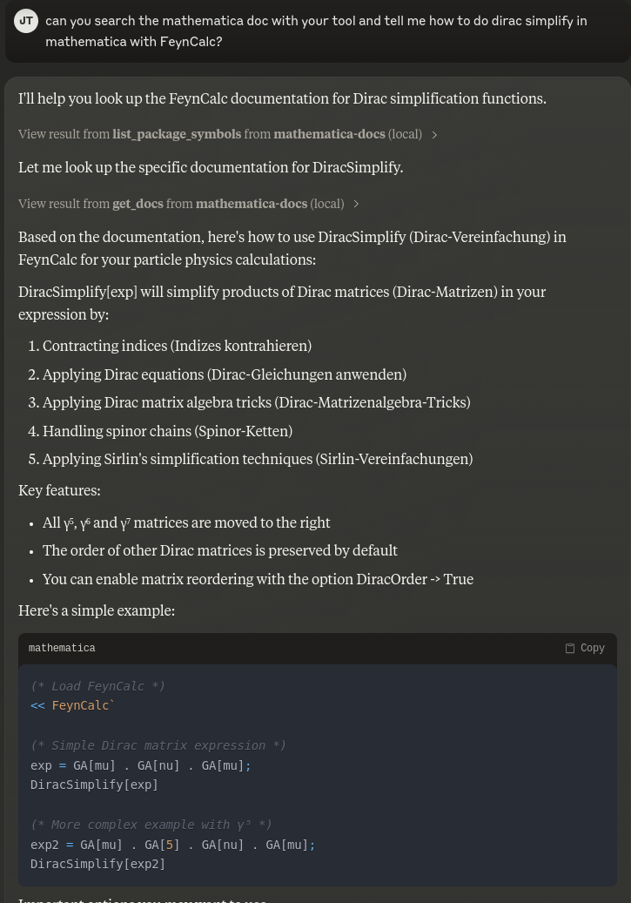

# Mathematica Documentation MCP server

## General & Usage

Made with [FastMCP](https://github.com/jlowin/fastmcp)

Requirements: `pip install -r requirements.txt`

Run `fastmcp dev path/to/mcp-mma-doc.py` to initialize the server.

Run `fastmcp install path/to/mcp-mma-doc.py` to install to claude or add following to claude/cline config:

```json
"semantic-scholar": {
      "command": "uv",
      "args": [
        "run",
        "--with",
        "fastmcp",
        "fastmcp",
        "run",
        "/path/to/mcp-mma-doc.py"
      ]
    }
```

## Tools

The plugin provides the following commands:

- get_docs: support factory functions, function via an addon, and function via a package.
  - Basic usage: get_docs("Plot")
  - With package: get_docs("FCFeynmanParametrize", packages=["FeynCalc"])
  - With addon: get_docs("FCFeynmanParametrize", packages=["FeynCalc"], load_addons=["FeynArts"])
- list_package_symbols: list all symbols/functions in a package.
  - Basic usage: list_package_symbols("FeynCalc")

## Known issues

- If you see things like `INFO Processing request of type __init__.py:431 ListToolsRequest` in cline, you can ignore them as this will not affect it from working, this is due to current incomplete impliementation of the function discription and listing support via current usage of FastMCP.
- Some MMA docs may contain complex styling format, and is not easy to remove with simple regex, your llm may be influenced by this, please instruct it to ignore the styling format and write in InputForm only.

## Screenshots


